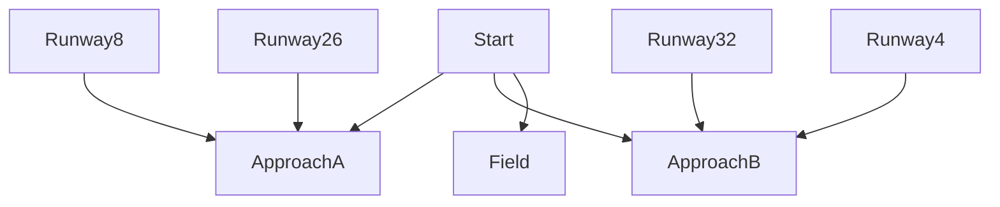

#

## Setting

You are in a plane where the engine fails in the middle of nowhere. You have to land safely.

## Story

## Global variables

The most important variable is 'isDead,' which is how the thing knows if you have won or lost. Another important variable would be 'altitude,' which changes what you can do, and if you get too low, 'isDead' is automatically true (because you crash and die if you don't save the landing). Your altitude starts at 5000ft, and you have to decide what to do before it runs out.
