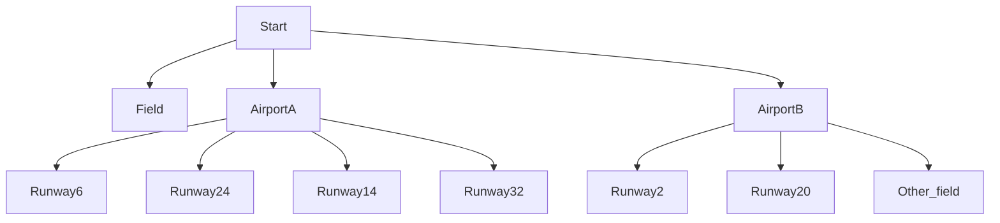

# MAYDAY MAYDAY!

## Setting

You are a student pilot flying solo when the engine fails in the middle of nowhere. You have to land safely.

## Story
You are a student pilot on your first solo, and the engine fails. You must pick the right airport and land or you die and your instructer gets fired because they signed you off. What will you do?

## Global variables

There are multiple global variables. The first one is "atc," which tracks whether you've talked to atc, though that doesn't do much because it doesn't change the story lines. The most important one is "towerBool," because it allows you to win the game (you can't win if it's false even if you pick the right path). There are other globals as well, like altitude, with ends the game if it gets too low.
